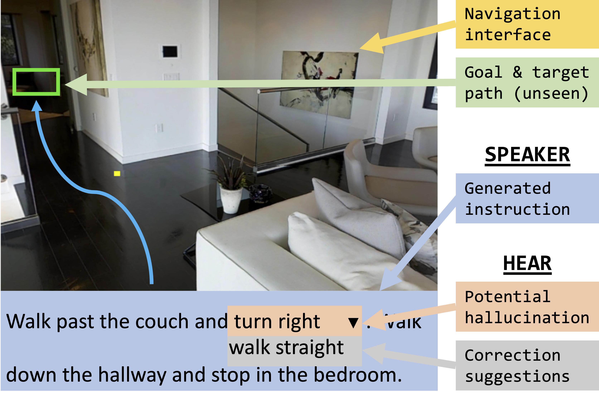

# Successfully Guiding Humans with Imperfect Instructions by Highlighting Potential Errors and Suggesting Corrections
This repository contains the code for model development and human evaluation interface. 
To assist human navigation with AI-generated instructions, we develop HEAR model to highlight hallucination spans and suggest possible corrections. The green box marks the ground-truth destination, and the orange highlight shows the hallucination span with correction suggestions in dropdown menu.

Visit [the project's website](https://lingjunzhao.github.io/HEAR.html) to learn more.




## 🛠️ Getting Started: Setup

Clone this Repo. Install the relevant dependencies through pip:

```
git clone https://github.com/lingjunzhao/HEAR.git

pip install -r requirements.txt
```

### 🐾 Train and Validation Dataset Link
Finally, download the synthetic training dataset from [this link](https://drive.google.com/file/d/1VGII-nJwC-UhZrd7afqGCitr4rLQDbMT/view?usp=sharing), 
unzip the file, 
and put the json files inside `cal_data/` folder.

### 🍀 Pre-trained Checkpoints
Download the pretrained Airbert model checkpoint from [this link](https://drive.google.com/file/d/1j0p5UGAQtKwJ505Y_z3QRr-Y1bGfQp1H/view?usp=sharing), 
put it under `model-zoos/` folder.

## 🌎 Training the HEAR Model

Use the bash script to train the hallucination detection classifier and hallucination type classifier:
```
run/train_hallucination_detection_parallel.sh
```

Use the bash script to train the hallucination type classifier:
```
run/train_hallucination_type_parallel.sh
```

The above scripts will generate folders in `data/runs/` containing model checkpoints.

If you want to use pretrained models instead, you can download the pretrained checkpoints from [this link](https://drive.google.com/file/d/1zSI2VNmq_XpZ9yGBEFqyd8I2CJ25Svff/view?usp=sharing),
and put them under `data/runs/` folder after unzipping.


## 🤖 Decoding the HEAR Model

Use the bash script to decode the hallucination detection classifier to obtain hallucination scores:
```
run/test_hallucination_detection.sh
```

The output will be saved in `data/runs/run-test_hallucination_detection/` folder.

Use the bash script to decode the hallucination type classifier to obtain intrinsic vs extrinsic scores:
```
run/test_hallucination_type.sh
```

The output will be saved in `data/runs/run-test_hallucination_type/` folder.

Merge the two-stage outputs using the following python script:

```
utils/process_alternative_output.py
```

The output would be saved as:

```
data/runs/run-test_hallucination_detection/_sigmoid_scores_t5_val_seen_highlighted_phrase_alters_gpt4_direction_dev_test_merged.json
```


## 📊 Human Evaluation Interface

Refer to the `human_evaluation/README.md` folder for instructions.